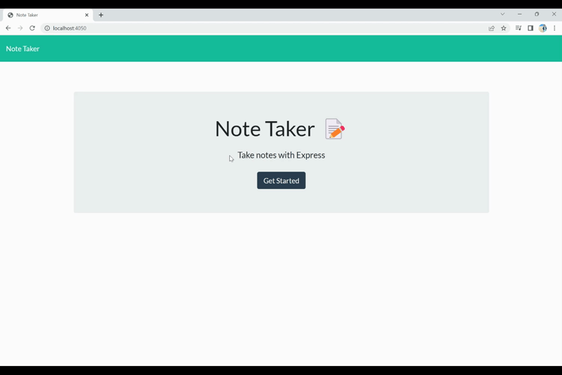

# Imrans-Note-Taker

## Description

This project is an application called Note Taker that can be used to write and save notes.This is a simple Note Taker application that allows users to add, view saved notes and also delete the notes if the user don't need that note anymore. This application uses an express backend and save and retrieve note data from a JSON file. 

## Table of Contents
* [Installation](#installation)
* [Video Walk Through](#videowalkthrough)
* [Usage](#usage)
* [License](#license)
* [Credits](#credits)
* [Questions](#questions)

## Installation

1. Clone the repository.
2. Node.js is required for application to run.
3. "npm install" to install the required npm packages.
4. "npm install express" to install the express.
5. "npm install uniqid" to install the uniqid.

## Video Walk Through

* You also can go through that link for <a href="https://drive.google.com/file/d/1SNWGBohtr1_xIpIP6sivgNbJXKDYgDmv/view">Video</a>
## Usage 

1. Clone the repo.
2. type "npm i" to install the necessary packages.
3. the run "node server.js"
4. Open the "localhost:4050" .
5. Then you can use the Note Taker.

## License

[MIT License](./LICENSE)

## Credits

* <a href="https://nodejs.org/">Node.js</a>
* <a href="https://www.npmjs.com/">NPM</a>
* <a href="https://www.npmjs.com/package/express">Express.js</a>
* <a href="https://www.npmjs.com/package/inquirer">Inquirer.js</a>
* <a href="https://www.npmjs.com/package/uuid">uuid</a>

## Questions

If you have any Questions :
  * Email : imran.rassi.2020@gmail.com
  * GitHub: [imran7rassi](https://github.com/imran7rassi)